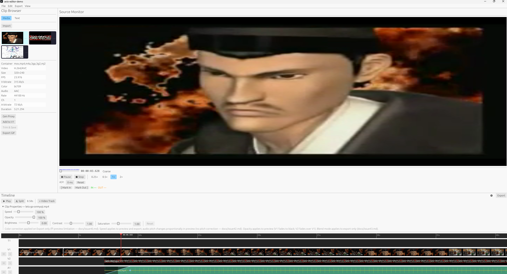
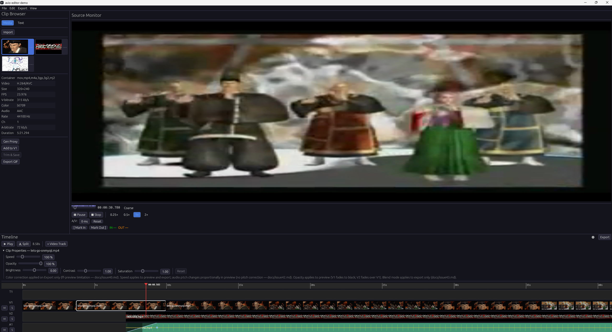

# avio-editor-demo

A non-linear video editor built on [`avio`](https://github.com/itsakeyfut/avio) —
the primary real-world driver for API validation and gap discovery before the v0.16.0 freeze.





## About

This project exists to stress-test `avio` through real-world use. Unit tests in isolation
miss an entire class of problems: missing builder methods, awkward multi-step workflows,
silent audio/video desyncs, and APIs that look correct on paper but fall apart at the seams
when composed together.

Building a full editor surfaces all of those gaps. Every friction point becomes a filed issue
in the [`avio`](https://github.com/itsakeyfut/avio) repository with a reproduction case and a
proposed fix. The `docs/` directory in this repo is a living log of every gap discovered so far.

> **Not a production tool.** UI polish is out of scope. The deliverable is the set of `avio`
> issues surfaced through hands-on use.

## Features

### Timeline

- Multi-track layout: **V1** (primary video), **V2** (overlay), **A1** (audio), **T1** (title text)
- Drag clips from the browser onto any track; snap-to-edge positioning
- Per-clip controls: speed (10–400%), opacity, blend mode, brightness/contrast/saturation, audio gain/fade
- Transitions between clips (xfade with configurable duration)
- Loop region with I/O markers, JKL shuttle transport, cut/split, duplicate, ripple delete
- Full undo/redo stack

### Text Titles (T1 track)

- Create text presets in the browser's **Text** tab, drag them onto the T1 lane
- Per-clip: font size (12–120 pt), colour, horizontal/vertical alignment
- Live text overlay rendered on the preview monitor during playback
- Composited into the exported video via FFmpeg `lavfi drawtext`

### Media Analysis

- Scene detection, silence detection, waveform visualization, keyframe extraction
- Proxy generation for smooth playback of high-resolution sources
- Loudness analysis (EBU R128 target)

### Export

- H.264 / AAC output via FFmpeg
- Resolution scaling, multi-track video compositing (V1 + V2 overlay + T1 text)
- Per-clip color correction applied at render time

## Getting Started

### Prerequisites

Rust 1.93+ and FFmpeg development libraries.

**Windows**
```powershell
vcpkg install ffmpeg:x64-windows
$env:VCPKG_ROOT = "C:\vcpkg"
```

**macOS**
```bash
brew install ffmpeg
```

**Linux (Debian/Ubuntu)**
```bash
sudo apt install libavcodec-dev libavformat-dev libavutil-dev \
                 libswscale-dev libswresample-dev libavfilter-dev
```

### Build and run

```bash
git clone https://github.com/itsakeyfut/avio-editor-demo
cd avio-editor-demo
cargo run
```

### Development commands

```bash
cargo build                   # compile
cargo clippy -- -D warnings   # lint
cargo fmt -- --check          # format check
cargo test                    # run tests
```

## Architecture

```
src/
├── main.rs             # eframe::App entry point and Tokio runtime
├── state.rs            # AppState — all timeline, playback, and UI state
├── export.rs           # Export pipeline: builds avio::Timeline, spawns render task
├── player.rs           # Source monitor playback helpers
├── presets.rs          # Preset serialization (JSON)
└── ui/
    ├── timeline.rs     # Timeline panel: tracks, clips, ruler, transport bar
    ├── clip_browser.rs # Left panel: media library + text preset browser
    ├── monitor.rs      # Source monitor and timeline preview panels
    ├── drain.rs        # Per-frame background result draining (thumbnails, waveforms, …)
    └── …
```

The egui render loop runs on the main thread at ~60 fps. Every slow operation —
thumbnail extraction, scene detection, proxy generation, export — runs in
`tokio::task::spawn_blocking` and communicates back to the render loop via `mpsc` channels.

## Platform Support

| Platform | Status |
|----------|--------|
| Windows  | ✅ |
| macOS    | ✅ |
| Linux    | ✅ |

## License

Licensed under either of [MIT](LICENSE-MIT) or [Apache-2.0](LICENSE-APACHE) at your option.
